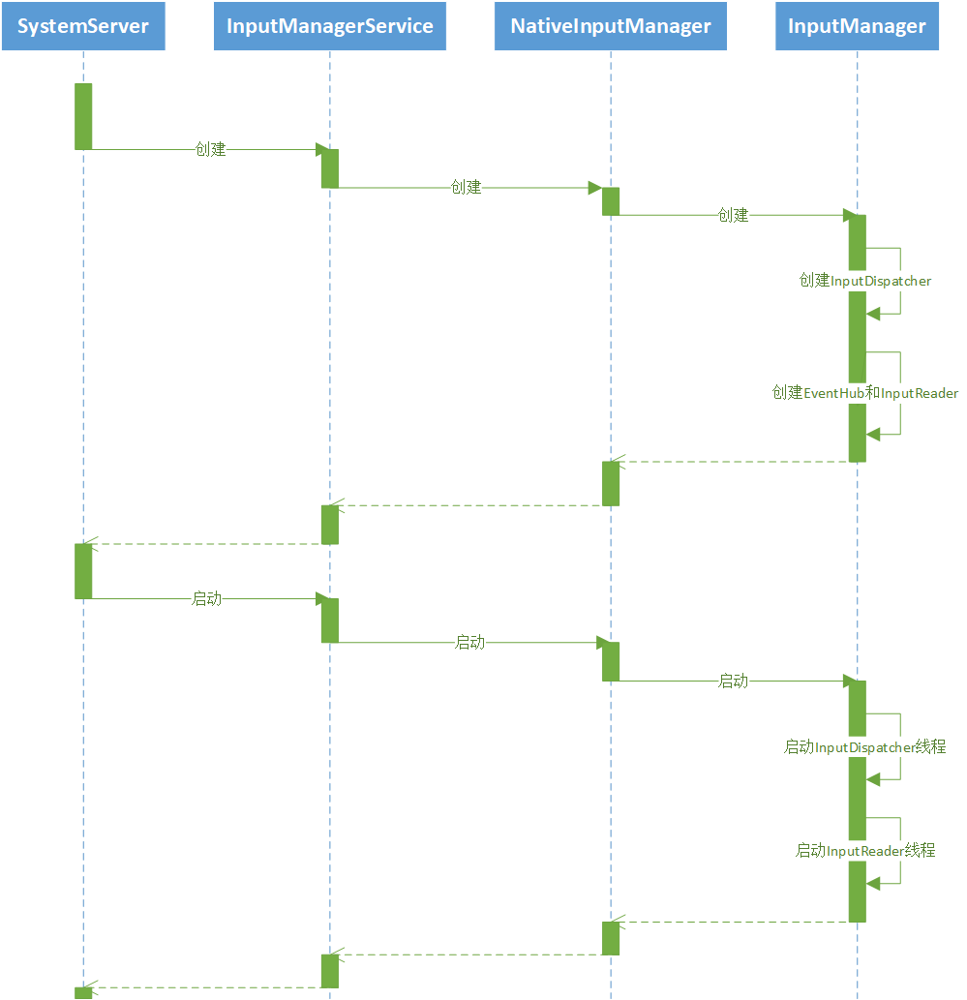

# Input事件native层分发流程（一）

android的Input子系统主要包括三个模块：EventHub、InputReader和InputDispatcher。EventHub使用epoll和notify机制，不断从设备节点中读取Input事件；InputReader负责将原始事件进行处理和封装；InputDispatcher负责将处理好的事件分发出去。这个系列笔记主要记录了我学习android Input子系统的一些成果。本篇首先谈谈Input子系统的创建。

## Input子系统创建流程时序图


## Input子系统的创建流程

android系统的启动过程中，会启动名为SystemServer的进程，该进程会启动很多系统服务，其中一项服务便是InputManagerService，以下简称为IMS。
```java
// frameworks/base/services/java/com/android/server/SystemServer.java
// 启动SystemServer进程，会执行SystemServer对象的run函数。
public static void main(String[] args) {
    new SystemServer().run();
}

// 在run函数中会启动三类服务，BootstrapServices、CoreServices和OtherServices
private void run() {
    ···
    startBootstrapServices(t);
    startCoreServices(t);
    startOtherServices(t);
    ···
}

// IMS在OtherServices中，通过创建一个InputManagerService对象来启动。
private void startOtherServices(@NonNull TimingsTraceAndSlog t)  {
    ···
    inputManager = new InputManagerService(context);
    ···
}
```

IMS创建过程中会调用native层的nativeInit函数来创建一个NativeInputManager对象。
```cpp
// frameworks/base/services/core/jni/com_android_server_input_InputManagerService.cpp
static jlong nativeInit(JNIEnv* env, jclass /* clazz */,
        jobject serviceObj, jobject contextObj, jobject messageQueueObj) {
    ...
    NativeInputManager* im = new NativeInputManager(contextObj, serviceObj,
            messageQueue->getLooper());
    ...
}
```

而在NativeInputManager的构造函数中，又会创建一个InputManager对象，正是这个InputManager对象，创建了EventHub，InputReader和InputDispatcher三个对象。
```cpp
// frameworks/base/services/core/jni/com_android_server_input_InputManagerService.cpp
NativeInputManager::NativeInputManager(jobject contextObj,
        jobject serviceObj, const sp<Looper>& looper) :
        mLooper(looper), mInteractive(true) {
    ···
    mInputManager = new InputManager(this, this);
    ···
}

// frameworks/native/services/inputflinger/InputManager.cpp
// InputManager的构造函数会调用InputReader和InputDispatcher的工厂方法来创建它们的对象。
InputManager::InputManager(
        const sp<InputReaderPolicyInterface>& readerPolicy,
        const sp<InputDispatcherPolicyInterface>& dispatcherPolicy) {
    mDispatcher = createInputDispatcher(dispatcherPolicy);
    mClassifier = new InputClassifier(mDispatcher);
    mReader = createInputReader(readerPolicy, mClassifier);
}

// frameworks/native/services/inputflinger/dispatcher/InputDispatcherFactory.cpp
sp<InputDispatcherInterface> createInputDispatcher(
        const sp<InputDispatcherPolicyInterface>& policy) {
    return new android::inputdispatcher::InputDispatcher(policy);
}

// frameworks/native/services/inputflinger/reader/InputReaderFactory.cpp
// InputReader的工厂方法会同时创建一个EventHub对象，并将这个对象传递给InputReader。
sp<InputReaderInterface> createInputReader(const sp<InputReaderPolicyInterface>& policy,
                                           const sp<InputListenerInterface>& listener) {
    return new InputReader(std::make_unique<EventHub>(), policy, listener);
}
```

NativeInputManager实现了两个接口，InputReaderPolicyInterface和InputDispatcherPolicyInterface。这两个接口分别用于InputReader和InputDispatcher和其他服务之间的通信。因此NativeInputManager对象会作为参数传入InputReader和InputDispatcher的构造函数中，并被赋值给它们对应的mPolicy属性。

## Input子系统启动流程

上面在IMS的构造函数中，依次创建了InputDispatcher、EventHub和InputReader对象。在之后，SystemServer的run函数会调用IMS的start函数来启动InputReader和InputDispatcher线程。这个函数调用流程为：IMS的start函数调用native层的nativeStart函数，nativeStart函数会调用InputManager的start函数，InputManager的start函数会分别调用InputReader和InputDispatcher的start函数，最终启动InputReader和InputDispatcher线程。
```cpp
// frameworks/base/services/core/jni/com_android_server_input_InputManagerService.cpp
static void nativeStart(JNIEnv* env, jclass /* clazz */, jlong ptr) {
    NativeInputManager* im = reinterpret_cast<NativeInputManager*>(ptr);
    status_t result = im->getInputManager()->start();
    ···
}

// frameworks/native/services/inputflinger/InputManager.cpp
status_t InputManager::start() {
    status_t result = mDispatcher->start();
    ···
    result = mReader->start();
    ···
}

// frameworks/native/services/inputflinger/dispatcher/InputDispatcher.cpp
status_t InputDispatcher::start() {
    if (mThread) {
        return ALREADY_EXISTS;
    }
    mThread = std::make_unique<InputThread>(
            "InputDispatcher", [this]() { dispatchOnce(); }, [this]() { mLooper->wake(); });
    return OK;
}

// frameworks/native/services/inputflinger/reader/InputReader.cpp
status_t InputReader::start() {
    if (mThread) {
        return ALREADY_EXISTS;
    }
    mThread = std::make_unique<InputThread>(
            "InputReader", [this]() { loopOnce(); }, [this]() { mEventHub->wake(); });
    return OK;
}
```

